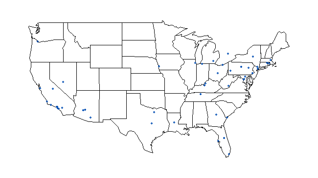
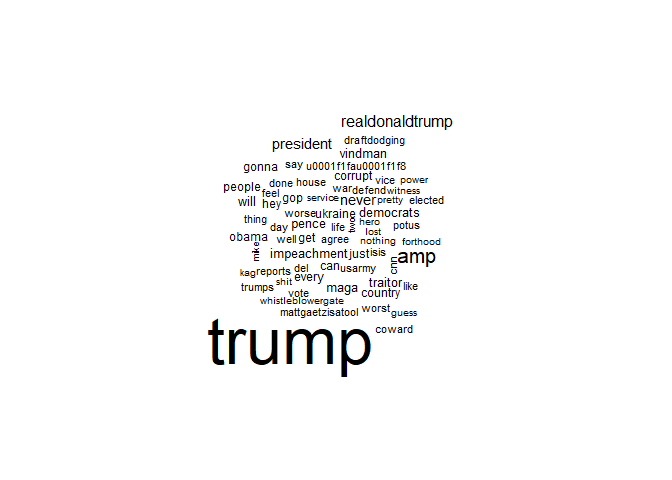
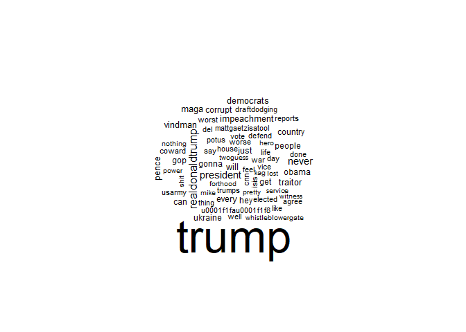

Twitter Basics
================

## Setup

``` r
# load libraries ----
library(rtweet)
library(tidyverse)
library(maps)
library(tidytext)
library(httpuv)
library(wordcloud)
```

## 1 - Authenticate for Twitter API access

#### If you don’t know how to get these values see [this tutorial](https://rtweet.info/articles/auth.html)

``` r
# first establish authentication. Replace the dummy values below with your own
# store api keys (these are fake example values; replace with your own keys)
api_key <- "afYS4vbIlPAj096E60c4W1fiK"
api_secret_key <- "bI91kqnqFoNCrZFbsjAWHD4gJ91LQAhdCJXCj3yscfuULtNkuu"

# authenticate via web browser
token <- create_token(
  app = "YourApp",
  consumer_key = api_key,
  consumer_secret = api_secret_key)
```

## 2 - Search tweets and save them

#### (Or jump to step 3 if you’ve downloaded the [“trump\_tweets.csv”](https://drive.google.com/file/d/16CrtaNqrNjMDGB5m9PIjAHH1MrUgiBej/view?usp=sharing) data directly)

``` r
# search for 5000 tweets sent from the US mentioning Trump
tweets <- search_tweets("#trump", geocode = lookup_coords("usa"), n = 5000)

# you could also search a user's timeline
trump <- get_timelines("realdonaldtrump", n = 500)

# unlist and save as csv
save_as_csv(tweets, "trump_tweets.csv")
```

## 3 - In what states are people tweeting about Trump?

``` r
#if you didn't collect your own tweets load in file of Trump tweets
tweets <- read_csv("trump_tweets.csv")

# plot on a map
# create lat/lng variables using all available tweet and profile geo-location data
# note: you may not have much lat_lng data in your available set, depends on which users appear in your set
# geo-tagged data is often sparse
tweets <- lat_lng(tweets)

#plot state boundaries
par(mar = c(0, 0, 0, 0))
maps::map("state", lwd = .25)

#plot lat and lng points onto state map
with(tweets, points(lng, lat, pch = 20, cex = .75, col = rgb(0, .3, .7, .75)))
```

<!-- -->

## 3 - Explore most used words in dataset - construct wordcloud

``` r
#tokenize
tweets_tokens <- tweets %>% unnest_tokens(word, text, token="tweets")

#plot
wordcloud(tweets_tokens$word, min.freq=200)
```

<!-- -->

#### You can take out commonly occuring expressions that aren’t of interest to make a cleaner word cloud using something like this

``` r
tweets_tokens_trim <- tweets_tokens %>% filter(word != 'amp')

#replot
wordcloud(tweets_tokens_trim$word, min.freq=200)
```

<!-- -->
